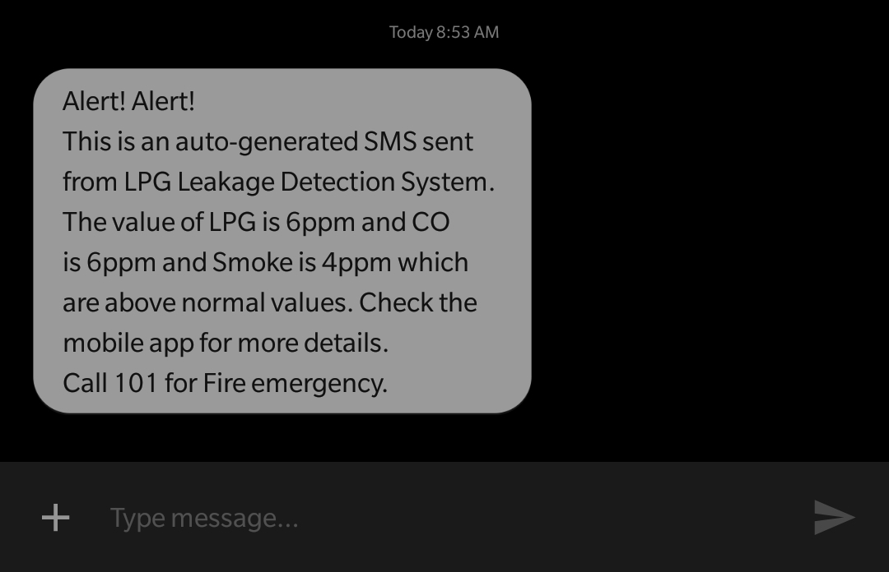
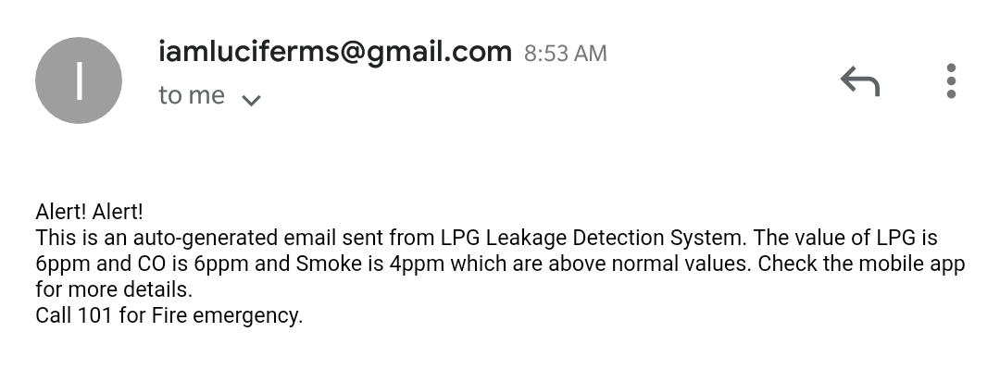

# LPG-Leakage-Detection-and-Alert
This is a project submitted for TARP(Technical Answers to Real World Problem) in college.

# Hardware Components Used
1. Node mcu
2. MQ2 sensor to detect lpg, co and smoke
3. Serial Buzzer
4. Bread Board

# Software Components Used
1. Django for dashboard
2. Amazon boto3 for sending text messages
3. Amazon SES (Simple Email Service) for sending emails
4. ThingSpeak for recieving data from node-mcu

# SMS and Email example
SMS:

Email: 

